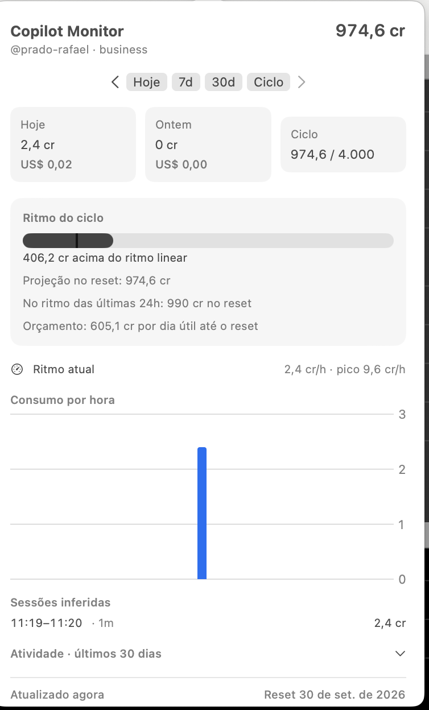

# Copilot Monitor


App de barra de menus para acompanhar os créditos de uso do Copilot pela API do GitHub. Os dados ficam em `~/Library/Application Support/CopilotMonitor/usage.sqlite`; nenhum log local do Copilot é lido.

## Compilar

Requer macOS 14+, Swift 5.10 e Command Line Tools. Execute `./build.sh`; o app será criado em `build/CopilotMonitor.app`. O primeiro acesso usa `gh auth token` (com `gh` em `/opt/homebrew/bin` ou `/usr/local/bin`); um token alternativo pode ser salvo no Keychain nas Preferências.

## Teste e demonstração

`swift run CopilotMonitorSelfTest` executa os asserts da lógica pura. Para abrir a interface com dados sintéticos e sem chamadas de rede, execute:

```sh
COPILOT_MONITOR_DEMO=1 .build/debug/CopilotMonitor
```

O modo demo usa `usage-demo.sqlite`, sem alterar o banco normal.
# copilot-monitor-mac-app
